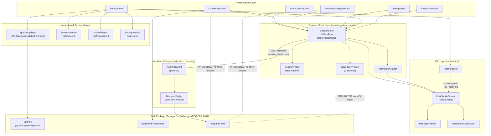
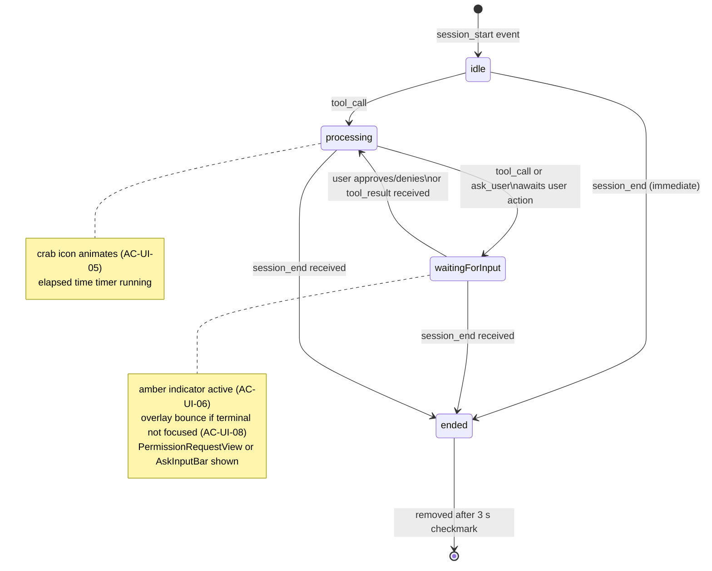
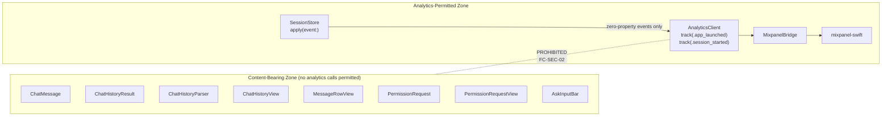
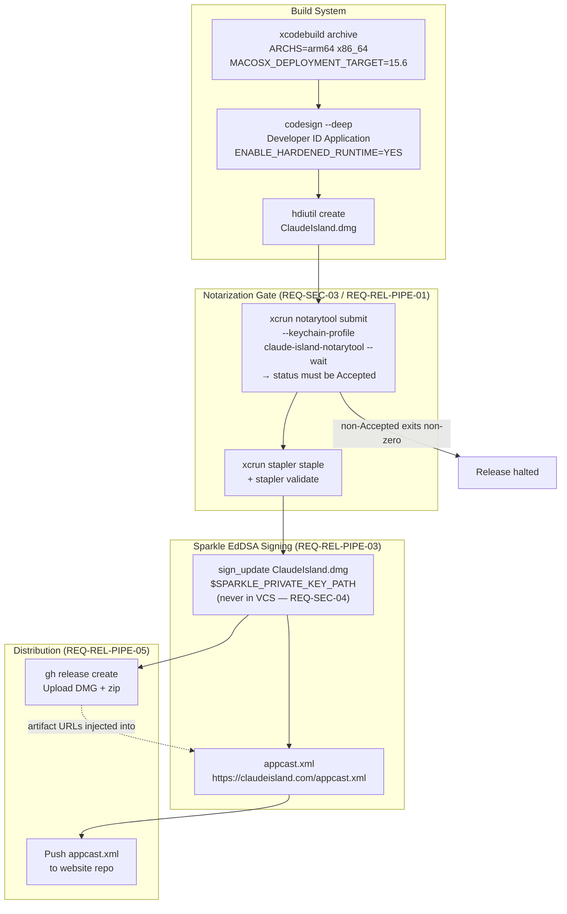

---
codd:
  node_id: detail:component_dependency_map
  type: design
  depends_on:
  - id: design:system-design
    relation: depends_on
    semantic: technical
  - id: design:ui-design
    relation: depends_on
    semantic: technical
  - id: design:ipc-hook-design
    relation: depends_on
    semantic: technical
  - id: design:session-lifecycle-design
    relation: depends_on
    semantic: technical
  - id: design:chat-rendering-design
    relation: depends_on
    semantic: technical
  - id: design:release-pipeline-design
    relation: depends_on
    semantic: technical
  depended_by:
  - id: plan:implementation-plan
    relation: depends_on
    semantic: technical
  conventions:
  - targets:
    - detail:component_dependency_map
    reason: Component boundaries must assume App Sandbox is disabled; no sandboxed
      entitlements may be relied upon (REQ-SEC-01). All SPM package dependencies (Sparkle,
      swift-markdown, mixpanel-swift) must appear as declared edges (REQ-BUILD-01).
  - targets:
    - detail:component_dependency_map
    reason: The analytics component must be isolated so that conversation content
      can provably never reach the Mixpanel SDK (REQ-SEC-05). A dependency path from
      chat data to analytics is a release-blocking privacy violation.
---

# Component Dependency Map

## 1. Overview

This document maps every first-party component and third-party Swift Package Manager dependency in Claude Island, defines canonical ownership for each boundary, and records the implementation constraints that flow from those boundaries. It synthesises `design:system-design`, `design:ui-design`, `design:ipc-hook-design`, `design:session-lifecycle-design`, `design:chat-rendering-design`, and `design:release-pipeline-design` into a single authoritative reference for the dependency graph.

Two constraints are release-blocking at the dependency level and must be reflected in every import decision:

**REQ-SEC-01 / ADR-001 — App Sandbox is permanently disabled.** No sandboxed entitlement (`com.apple.security.app-sandbox = true`) may be relied upon. Every component that accesses `~/.claude/`, `NSScreen`, or the Unix socket does so under a hardened-runtime, non-sandboxed process. CI asserts `app-sandbox = false` before code signing.

**REQ-SEC-05 / FC-SEC-02 — The analytics component is structurally isolated.** No module other than `AnalyticsClient` and its sole conforming type `MixpanelBridge` may import `mixpanel-swift`. A dependency path from any chat-content type (`ChatMessage`, `ChatHistoryResult`, `PermissionRequest`, `Session`) to `MixpanelBridge` is a release-blocking privacy violation. The Mixpanel call-site audit at release time (AC-SEC-03) verifies this statically.

All third-party dependencies are resolved exclusively through Swift Package Manager (`Package.swift`). No CocoaPods, Carthage, or manual xcframework embedding is permitted (REQ-BUILD-01). The three declared SPM packages — `Sparkle`, `apple/swift-markdown`, and `mixpanel-swift` — each appear as explicit edges in the diagrams below.

---

## 2. Mermaid Diagrams

### 2.1 Top-Level Module Dependency Graph



**Ownership and boundary notes:**

`SessionStore` is the single permitted caller of `AnalyticsClient`. Only two events — `app_launched` (fired once at startup) and `session_started` (fired on `session_start` IPC event with zero content properties) — may cross this boundary. `ChatHistoryParser`, `PermissionRequestView`, `ChatHistoryView`, and `AskInputBar` have no access to `AnalyticsClient` or `MixpanelBridge`. The dashed prohibition edges are enforced at release by auditing every file under `Chat/`, `Permission/`, and `IPC/` for any reference to `AnalyticsClient.track` or `MixpanelBridge`. A hit blocks release (FC-SEC-02).

`apple/swift-markdown` is imported only by `ChatHistoryView` (specifically `AssistantMessageView`) for Markdown-to-`AttributedString` rendering. No other module requires Markdown parsing.

`Sparkle` (`SPUStandardUpdaterController`) is imported only by `SparkleUpdater`, which is owned by the Integration layer and surfaced through `SettingsView`. The EdDSA public key (`SUPublicEDKey`) is embedded in `Info.plist`; the corresponding private key is never committed to VCS (REQ-SEC-04, ADR-003).

---

### 2.2 IPC and Hook Installer Flow

```mermaid
sequenceDiagram
    participant HS as ~/.claude/hooks/<br/>hook script
    participant SA as SocketActor<br/>(background)
    participant MFr as MessageFramer
    participant SSt as SessionStore<br/>(@MainActor)
    participant PR as PermissionRouter
    participant UI as PermissionRequestView

    HS->>SA: connect() to ~/.claude/claude-island.sock
    HS->>SA: write JSON frame + \n
    SA->>MFr: buffer bytes until \n
    MFr->>SA: complete frame Data
    SA->>SA: JSONDecoder.decode(IPCEvent)
    SA-->>SSt: Task @MainActor { apply(event:) }
    Note over SA,SSt: ≤ 100 ms total<br/>(REQ-PERF-02 / FC-PERF-01)
    SSt->>PR: register(requestId: fd:)
    SSt->>SSt: @Published sessions update
    SSt-->>UI: SwiftUI observes @Published

    UI-->>PR: respond(requestId: decision:)
    PR->>SA: Task on SocketActor { write(response) }
    SA->>HS: response JSON written to held fd
    SA->>SA: close(fd); remove from registry
```

**Ownership:** `SocketActor` owns the file descriptor lifecycle. `MessageFramer` is a pure value-type helper owned by `module:ipc`; it has no reference to `SessionStore`. The actor-hopping pattern (`Task @MainActor`) is the only permitted crossing from `SocketActor` to `SessionStore`; synchronous main-thread calls from socket I/O are prohibited (REQ-PERF-03). The open-connection registry (`[String: FileDescriptor]`) is private to `PermissionRouter` and is accessed only from the main actor.

---

### 2.3 SessionPhase State Machine



**Ownership:** `SessionPhase` and its transition guard are owned exclusively by `SessionStore`. No other type may directly mutate a `Session.phase` value. All five valid transitions must have passing unit tests in `ClaudeIslandTests` (REQ-TEST-02, AC-TEST-02); absence of any one test is FC-TEST-01, a release-blocking failure. Invalid transitions (e.g., `ended → processing`) are rejected, logged at `os_log` `.error`, and leave phase unchanged; they never crash.

---

### 2.4 Analytics Isolation Boundary



**Compliance statement:** This diagram reflects REQ-SEC-05 and the release-blocking failure criterion FC-SEC-02. Every type in the Content-Bearing Zone is structurally prevented from calling `AnalyticsClient.track()` or importing `mixpanel-swift`. The prohibition is verified at release by a Mixpanel call-site audit (AC-SEC-03) that asserts zero `AnalyticsClient.track` references exist in files under `Chat/`, `Permission/`, and any file that imports `ChatMessage` or `PermissionRequest`. Any violation halts the release.

---

### 2.5 Release Pipeline Component Graph



**Ownership:** `scripts/build.sh` owns stages 1–5; `scripts/create-release.sh` owns stages 6–8. No artifact may be uploaded (stage 7) before the notarization gate (stages 4–5) passes and before the EdDSA signature (stage 6) is captured. `appcast.xml` update (stage 8) is the final step; it must never precede a passing `xcrun stapler validate`.

---

## 3. Ownership Boundaries

### 3.1 module:ipc

**Owner:** `UnixSocketServer`, `MessageFramer`, `ReconnectCoordinator`, `HookInstaller`.

`module:ipc` is the sole module that binds the Unix domain socket at `~/.claude/claude-island.sock`. No other module creates network or socket connections of any kind. CI asserts that `NWConnection`, `URLSession`, and `CFSocket` symbols are absent from the `module:ipc` source tree (REQ-INT-02). The socket file is created with permissions `0600` (owner read/write only). Frames exceeding 1 MiB are discarded and the connection is closed to prevent unbounded memory growth.

`HookInstaller` is the sole component that writes to or reads from `~/.claude/hooks/`. It must not be called without the consent gate (`hooksConsentGranted = true` in `UserDefaults`) having been confirmed. The consent gate is enforced by `SettingsView`'s confirmation `Alert` before any call to `HookInstaller.install()`. Calling `HookInstaller.install()` without consent must throw `HookInstallerError.consentNotGranted`; this is covered by a unit test (FC-HOOK-01, REQ-HOOK-01). No background or automatic write path to `~/.claude/hooks/` exists outside `HookInstaller`.

`ReconnectCoordinator` owns the exponential back-off reconnect schedule (250 ms → 500 ms → 1 s → 2 s → 4 s → 8 s cap). Full socket availability must be restored within 10 seconds of a disruption without requiring an app restart (REQ-REL-01, FC-REL-01).

### 3.2 module:session-monitor

**Owner:** `SessionStore`, `SessionPhase`, `ChatHistoryParser`, `PermissionRouter`.

`SessionStore` is the single authoritative source of truth for session state. It is declared `@MainActor`. All mutations to `sessions: [UUID: Session]` and `chatHistory: [UUID: ChatHistoryResult]` occur on the main actor. No other module holds a mutable reference to `Session` values; `Session` is a value type and `SessionStore` replaces dictionary entries rather than mutating them in place, satisfying the project's immutability requirement.

`ChatHistoryParser` is isolated to `ChatActor` (a declared Swift global actor). All JSONL file I/O and `JSONDecoder` calls are confined to `ChatActor`. The main thread must never block on file parsing; this is verified by `testMainThreadNotBlockedDuringParse` (FC-PERF-03). A missing or corrupt JSONL file produces `ChatHistoryResult.empty` or `ChatHistoryResult.error(String)` without crashing (FC-REL-02).

`PermissionRouter` is owned exclusively by `SessionStore` and accessed only from the main actor. It holds the open-connection registry `[String: FileDescriptor]`. It writes approval/denial responses to the file descriptor that originated the `tool_call` or `ask_user` event — the mechanism that guarantees correct tmux pane routing without any `tmux send-keys` side channel (REQ-PERM-05, FC-PERM-01). Connections older than 120 seconds are expired with a deny response.

### 3.3 Presentation Layer

**Owners:** `NotchOverlayView`, `ChatHistoryView`, `PermissionRequestView`, `AskInputBar`, `SettingsView`, `SessionListView`.

All view types conform to `View` and observe `SessionStore` via `@EnvironmentObject` or `@ObservedObject`. They may call `AnalyticsClient` through `SessionStore` only — they do not call `AnalyticsClient.track()` directly. None of the presentation types import `mixpanel-swift`.

`ChatHistoryView` is the sole import site of `apple/swift-markdown` within the presentation layer. `AssistantMessageView` passes message body text through `apple/swift-markdown`'s `Document` parser; all other view types render using standard `Text` or `AttributedString`.

The overlay `NSWindow` is configured with `canBecomeKey = false`. `NSApp.activate` is never called in response to overlay interactions. The terminal retains keyboard focus at all times except when the user explicitly taps `AskInputBar` (open question OQ-UI-002 governs the key-focus edge case).

All state transitions use SwiftUI spring animations targeting ≥ 60 fps (REQ-PERF-01). Any transition producing a frame exceeding 16.67 ms on a Release build on either Apple Silicon or Intel is FC-PERF-02, a release-blocking failure, verified by `xcrun xctrace` in CI.

### 3.4 Integration & Services Layer

**Owners:** `SparkleUpdater`, `ScreenSelector`, `SoundPlayer`, `SMAppService` binding in `SettingsView`.

`SparkleUpdater` is the sole import site of the `Sparkle` SPM package. It wraps `SPUStandardUpdaterController` and exposes an `updateIsAvailable: Bool` publisher consumed by `SettingsView`'s gear-button badge (AC-UPD-03). The `SUPublicEDKey` in `Info.plist` is the Ed25519 public key for update verification; the private key is stored exclusively in `.sparkle-keys/` (gitignored) and in the secrets manager (ADR-003).

`ScreenSelector` wraps `NSScreen.screens` and persists the selected display using a `CGDirectDisplayID`-based identifier in `UserDefaults["selectedDisplayIdentifier"]`. On disconnect of the selected screen, it falls back silently to `NSScreen.screens.first`; absence of this fallback path is FC-REL-03. `ScreenSelector` re-evaluates on `NSApplication.didChangeScreenParametersNotification`.

`SoundPlayer` wraps `AVFoundation`. It plays the user-selected system sound from `/System/Library/Sounds/` when a session transitions to `ended` with success, but only when the terminal hosting the session is not the frontmost application (AC-SOUND-05). No AVFoundation import exists outside `SoundPlayer`.

### 3.5 Analytics Subsystem

**Owner:** `AnalyticsClient` (protocol), `MixpanelBridge` (sole conforming type and sole `mixpanel-swift` import site).

`MixpanelBridge` is the only Swift file in the project that contains `import mixpanel_swift`. No other source file may add this import; CI's Mixpanel call-site audit (AC-SEC-03, FC-SEC-02) enforces this structurally. The two permitted events are:

- `app_launched` — fired once at startup from `AppDelegate` or `@main` entry point via `SessionStore`. No additional properties.
- `session_started` — fired from `SessionStore.apply(event:)` on `session_start` IPC event. No properties identifying session ID, working directory, tool names, or any content.

The Mixpanel project token is a non-secret value embedded in the binary. No device fingerprint, IP address correlation, or user ID is persisted (ADR-008). A `UserDefaults`-gated opt-out flag (`analyticsOptOut`) is supported architecturally by wrapping all `MixpanelBridge` calls behind the flag, but the Settings UI item does not yet exist pending resolution of OQ-001 / OQ-UI-004 before EU distribution.

---

## 4. Implementation Implications

### 4.1 App Sandbox Absence (REQ-SEC-01 / ADR-001)

Because App Sandbox is disabled, all components that access `~/.claude/` — `UnixSocketServer` (socket bind), `HookInstaller` (script writes), `ChatHistoryParser` (JSONL reads), and `ScreenSelector` (writing `UserDefaults`) — operate with full POSIX file-system access under the user's UID. This means:

- The socket file `~/.claude/claude-island.sock` must be created with `0600` to prevent other local users from injecting events.
- `HookInstaller` must never write to `~/.claude/hooks/` without the explicit consent gate (FC-HOOK-01). There is no sandbox boundary to catch an accidental write; the guard must be in application logic.
- CI must assert `com.apple.security.app-sandbox = false` in the entitlements file before code signing. Any build where this assertion fails must not be signed or distributed.

Hardened runtime is enabled (`ENABLE_HARDENED_RUNTIME = YES`, ADR-002). The Unix socket API (`socket`, `bind`, `listen`, `accept`, `read`, `write`, `close`) is fully compatible with hardened runtime; no entitlement exceptions are required for IPC. No JIT, no library-validation disable, and no `dyld-environment-variable` entitlements may be introduced without a new ADR.

### 4.2 SPM Package Constraints (REQ-BUILD-01)

`Package.swift` is the sole dependency manifest. Three packages are declared:

| Package | Resolution requirement |
|---|---|
| `Sparkle` (`sparkle-project/Sparkle`) | Must build as Universal Binary (arm64 + x86_64); Sparkle's XPC-based installer is compatible with hardened runtime |
| `apple/swift-markdown` | Must compile from source as Universal; imported only by `ChatHistoryView` |
| `mixpanel-swift` | Must build as Universal; imported only by `MixpanelBridge` |

`Package.resolved` is committed to version control. Adding any fourth dependency requires an ADR. Importing any SPM package into a module that should not depend on it (e.g., importing `mixpanel-swift` outside `MixpanelBridge`) is a build-time error enforced by module boundaries and the release-time audit.

### 4.3 Latency Budget Allocation Across Component Boundaries

The 100 ms socket-to-`@Published` budget (REQ-PERF-02, FC-PERF-01) is distributed across component boundaries as follows:

| Boundary crossing | Budget | Mechanism |
|---|---|---|
| Hook script `write()` → `SocketActor` `read()` | ≤ 20 ms | Buffered read on background actor |
| `SocketActor` `JSONDecoder.decode()` | ≤ 10 ms | Synchronous on `SocketActor` before actor hop |
| `SocketActor` → `SessionStore` (`Task @MainActor`) | ≤ 30 ms | Swift async actor hop; main run loop scheduling |
| `SessionStore.apply()` dictionary update | ≤ 10 ms | O(1) dictionary replacement |
| SwiftUI `objectWillChange` → render | ≤ 30 ms | One 60 fps frame ≈ 16.7 ms |
| **Total** | **≤ 100 ms** | ±10 ms tolerance |

No synchronous blocking call may appear in the `SocketActor → SessionStore` path. `JSONDecoder` must run on `SocketActor` before the actor hop, not on the main actor after it.

The JSONL chat-history rendering budget is wider (≤ 500 ms file-read-to-rendered, REQ-PERF-04) because chat history updates are not on the critical approval-response path.

### 4.4 Integration Test Requirements (REQ-TEST-03, FC-TEST-02)

The `ClaudeIslandIntegrationTests` target must exercise the real `UnixSocketServer` bound to a temporary socket path under `/tmp/`. No mocked socket layer is used for IPC tests. The twelve required test cases from `design:ipc-hook-design` §2.6 cover socket connect, session event parsing, tool-call connection retention, response delivery, session-end transitions, disconnect-and-reconnect, consent gate, hook install/uninstall/upgrade, concurrent two-pane routing, and end-to-end latency. Absence of any single case is FC-TEST-02, a release-blocking failure.

The five `SessionPhase` transition unit tests in `ClaudeIslandTests` (REQ-TEST-02, AC-TEST-02) run against the real `SessionStore` — no stub or mock. Absence of any transition test is FC-TEST-01, a release-blocking failure.

### 4.5 Hook Script Versioning and Upgrade Path

Bundled hook scripts at `ClaudeIsland.app/Contents/Resources/hooks/` carry an embedded `CLAUDE_ISLAND_HOOK_VERSION` variable. `HookInstaller` reads the installed version on launch and calls `upgrade()` to overwrite if the bundled version differs. This handles the Sparkle-update case transparently. The naming convention for installed scripts (to avoid collision with user-written hooks at the same path) is an open question (OQ-IPC-02) that must be resolved before the hook installer ships.

### 4.6 Non-Notch Fallback Path

`NotchOverlayWindow` evaluates `NSScreen.safeAreaInsets.top > 0` at launch and on `NSApplication.didChangeScreenParametersNotification`. When the condition is false (Mac mini, non-notch MacBook Pro, external display), the overlay renders as a floating pill centered at the top of the selected screen with an 8 pt margin from the menu bar. Both modes share the same `NotchOverlayView` SwiftUI content tree; only the `NSHostingView` frame differs. Absence of the fallback path is FC-UI-01, a release-blocking failure (REQ-UI-04, REQ-COMPAT-03).

### 4.7 Release Pipeline Compliance

The release pipeline enforces the following component-level checks before any artifact is uploadable:

- `module:ipc` source tree contains no `NWConnection`, `URLSession`, or `CFSocket` references (REQ-INT-02).
- Entitlements file asserts `app-sandbox = false` (ADR-001, REQ-SEC-01).
- `codesign -dv` confirms hardened-runtime flag bit `0x10000` (ADR-002, REQ-BUILD-02).
- `lipo -info` confirms Universal Binary (`arm64 x86_64`) for the `.app` bundle and all three SPM-linked frameworks (REQ-COMPAT-02, ADR-009).
- `xcrun notarytool submit --wait` returns `Accepted`; `xcrun stapler validate` returns `The validate action worked!` (REQ-SEC-03, REQ-REL-PIPE-01, ADR-004).
- `sign_update` EdDSA signature is captured and injected into `appcast.xml` before the GitHub Release upload (REQ-REL-PIPE-03, ADR-006).
- `git ls-files .sparkle-keys/` returns empty before the release tag is created (REQ-SEC-04, ADR-003).

---

## 5. Open Questions

**OQ-CDM-01 — socat Dependency for Hook Scripts (inherits OQ-IPC-01)**
The bundled hook scripts use `socat` as the primary mechanism for opening a Unix domain socket. `socat` is not present on macOS by default, and the bash `/dev/tcp` fallback does not support `AF_UNIX` on macOS. The options — bundling a signed compiled helper binary, requiring Homebrew, or rewriting hooks in Swift/Go — each affect the component graph. A compiled helper binary is the most robust option and would create a new signed component (`ClaudeIsland Helper`) that must appear as an explicit node in this dependency map. A new ADR covering helper-binary signing and notarization is required before the hook installer ships.

**OQ-CDM-02 — Hook Script Naming and Collision Avoidance (inherits OQ-IPC-02 / OQ-006)**
The canonical install paths for hook scripts in `~/.claude/hooks/` are not yet determined. If scripts are installed as `pre-tool-call.sh`, they collide silently with user-written hooks at the same name. A naming prefix (`claude-island-pre-tool-call.sh`) or a subdirectory (`~/.claude/hooks/claude-island/`) changes the component boundary of `HookInstaller` and the hook script paths hardcoded in the protocol. This must be resolved before the hook installer toggle ships and reflected as a concrete edge in the diagram above.

**OQ-CDM-03 — Telemetry Opt-Out UI Placement (inherits OQ-001 / OQ-UI-004)**
EU distribution requires a `UserDefaults`-gated opt-out toggle in the Settings panel. Adding this item would introduce a seventh `SettingsView` entry, conflicting with AC-SET-02's count of exactly six. The Analytics subsystem boundary already supports the gate architecturally (`MixpanelBridge` calls are conditioned on the flag), but the Settings component graph does not yet include the seventh item. The dependency map must be updated when OQ-001 is resolved.

**OQ-CDM-04 — Sparkle Private Key Disaster Recovery (inherits OQ-PIPE-002 / FU-005)**
If the EdDSA private key is lost or compromised, the component responsible for producing a forced-migration build signed with both old and new keys is not defined. A transitional signing component or side-channel distribution mechanism would be a new entry in the release pipeline graph. This must be designed and reflected in the pipeline diagram before 1.0 GA.

**OQ-CDM-05 — Sequential vs. Concurrent Permission Requests Within a Single Session (inherits OQ-SLC-02)**
`Session` currently holds a single `pendingPermission: PermissionRequest?`. If Claude Code issues concurrent `tool_call` events for the same session, the queue data structure and draining logic in `PermissionRouter` are not yet fully specified. If a queue is introduced, it becomes a new component in the `module:session-monitor` boundary and its ownership boundary relative to `SessionStore` must be specified and reflected in the dependency map before concurrent tool-use scenarios are supported.
