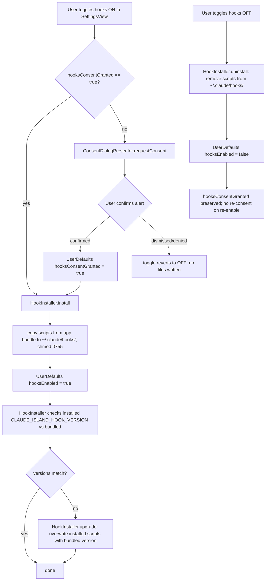
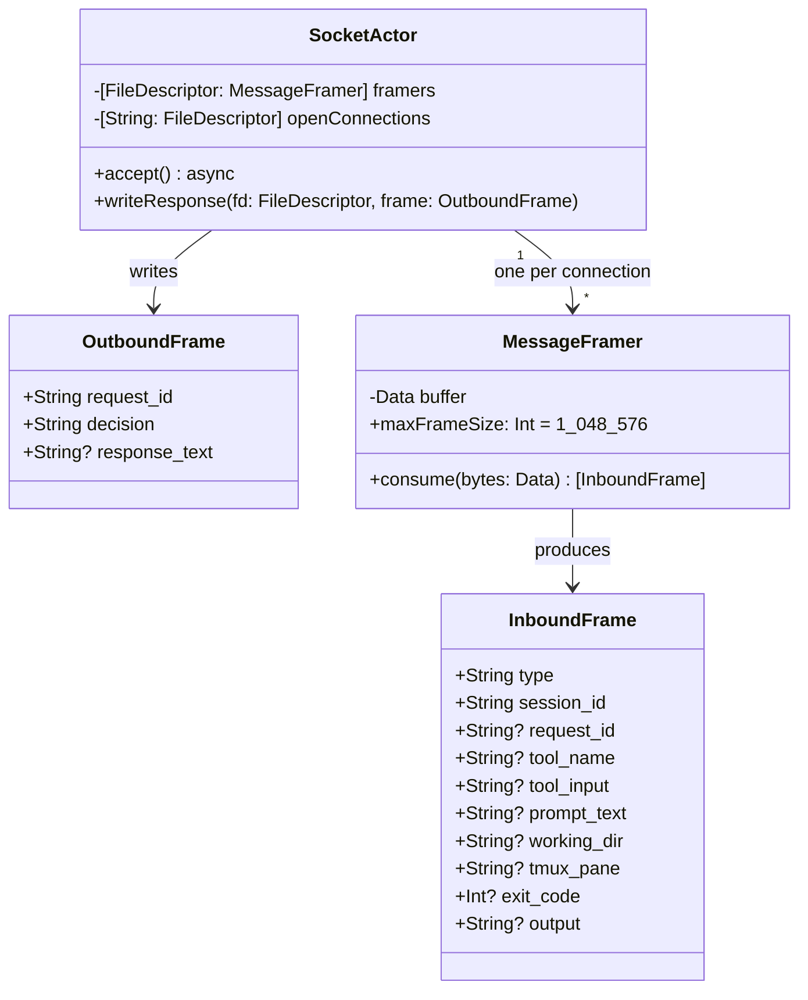

---
codd:
  node_id: detail:ipc_message_flow
  type: design
  depends_on:
  - id: design:ipc-hook-design
    relation: depends_on
    semantic: technical
  - id: design:session-lifecycle-design
    relation: depends_on
    semantic: technical
  depended_by:
  - id: test:test-strategy
    relation: depends_on
    semantic: technical
  - id: plan:implementation-plan
    relation: depends_on
    semantic: technical
  conventions:
  - targets:
    - detail:ipc_message_flow
    reason: All messages must transit the local Unix domain socket exclusively (REQ-INT-02).
      Protocol must carry session and tmux pane identifiers sufficient to route approvals
      correctly (REQ-PERM-05).
  - targets:
    - detail:ipc_message_flow
    reason: Reconnection sequence must be specified at the protocol level to satisfy
      automatic reconnection without app restart (REQ-HOOK-04, REQ-REL-01). Missing
      reconnection flow blocks release.
  - targets:
    - detail:ipc_message_flow
    reason: Integration tests must cover socket communication paths derived from this
      protocol (REQ-TEST-03).
---

# IPC Message Protocol and Flow Diagrams

## 1. Overview

This document specifies the complete wire protocol and message flow for all IPC communication between Claude Code CLI hook scripts and the Claude Island SwiftUI overlay. All messages transit a local Unix domain socket at `~/.claude/claude-island.sock` exclusively — no TCP, UDP, or network socket is created at any point (REQ-INT-02). The protocol carries `session_id`, `request_id`, and `tmux_pane` identifiers in every relevant frame, enabling `PermissionRouter` to route approval responses to the correct originating hook client without broadcast or side-channel mechanisms (REQ-PERM-05).

The protocol has two participants: **hook script clients** (short-lived processes launched by the Claude Code CLI hooks system) and the **UnixSocketServer** (the app-side server, bound and listening on `SocketActor`). Hook scripts are the sole writers of inbound event frames; the server is the sole writer of response frames. `SessionStore` (main actor) and `PermissionRouter` are consumers, not socket participants.

**Release-blocking constraints addressed by this document:**

| ID | Constraint |
|---|---|
| REQ-INT-02 | All messages transit the Unix domain socket exclusively; no network sockets |
| REQ-PERM-05 | Every frame carries session and tmux pane identifiers sufficient for correct approval routing |
| REQ-HOOK-04 / REQ-REL-01 | Reconnection sequence operates at the protocol level; no app restart required; full rebind within 10 s |
| REQ-TEST-03 | Integration tests must exercise all socket communication paths defined in this document |
| REQ-PERF-02 / FC-PERF-01 | Socket write to `@Published` UI update ≤ 100 ms (±10 ms tolerance) |

---

## 2. Mermaid Diagrams

### 2.1 End-to-End `tool_call` Message Flow

The most complex IPC path involves a `tool_call` event that holds the hook script's connection open until a user decision is written back. This diagram covers the full round trip.

```mermaid
sequenceDiagram
    participant CLI as Claude Code CLI
    participant Hook as ~/.claude/hooks/pre-tool-call.sh
    participant Sock as UnixSocketServer (SocketActor)
    participant Framer as MessageFramer
    participant Store as SessionStore (MainActor)
    participant Router as PermissionRouter
    participant UI as PermissionRequestView

    CLI->>Hook: executes hook script via hooks system
    Hook->>Sock: connect() to ~/.claude/claude-island.sock
    Hook->>Sock: write({"type":"tool_call","session_id":"<uuid>","tool_name":"Bash","tool_input":"...","request_id":"<req-uuid>","tmux_pane":"%3"}\n)
    Hook-->>Hook: blocking read() waiting for response frame

    Sock->>Framer: buffer bytes until \\n found
    Framer->>Sock: complete frame parsed: IPCEvent.toolCall(sessionId, toolName, toolInput, requestId, tmuxPane)
    Sock->>Router: register(requestId, fd) — retain open FileDescriptor in openConnections[requestId]

    Sock->>Store: Task @MainActor { apply(event: .toolCall(...)) }
    Store->>Store: transition phase idle/processing → waitingForInput
    Store->>Store: set pendingPermission = PermissionRequest(toolName, toolInput, requestId)
    Store->>Store: set session.tmuxPane = "%3"
    Store-->>UI: @Published update triggers SwiftUI diff

    UI->>UI: display tool name, tool input to user
    UI->>Router: user taps Allow → respond(requestId, decision: .allow, responseText: nil)
    Router->>Sock: dispatch write task to SocketActor
    Sock->>Hook: write({"request_id":"<req-uuid>","decision":"allow","response_text":null}\n)
    Sock->>Sock: close(fd); remove openConnections[requestId]

    Hook->>Hook: read() returns response JSON
    Hook->>Hook: parse "decision":"allow" → exit 0
    Hook->>CLI: exit code 0 (allow) or exit code 2 (deny)
    CLI->>CLI: proceeds or aborts tool call
```

**Ownership:** `UnixSocketServer` and `SocketActor` own the socket transport layer exclusively. `MessageFramer` is owned by `SocketActor` — one instance per accepted connection. `PermissionRouter` is owned by `SessionStore` and is accessible only from the main actor. No other component writes to or reads from the `FileDescriptor` registry. Reimplementing the response-write path outside `PermissionRouter` would break the routing correctness guarantee (FC-PERM-01).

The response is delivered by writing to the file descriptor of the originating hook script connection — not via `tmux send-keys` or any pane-ID lookup. This is the canonical routing mechanism: the hook script in pane `%3` opened the connection and is blocking on `read()`; writing to that descriptor delivers the response to pane `%3` exclusively. No broadcast occurs.

---

### 2.2 Session Lifecycle Event Sequence

This diagram covers the full set of event types across a session's lifetime, from `session_start` through `session_end`, including the `ask_user` path.

```mermaid
sequenceDiagram
    participant Hook as Hook Script (any type)
    participant Sock as UnixSocketServer (SocketActor)
    participant Store as SessionStore (MainActor)
    participant UI as NotchOverlayView

    Hook->>Sock: {"type":"session_start","session_id":"<uuid>","working_dir":"/path","tmux_pane":"%3"}\n
    Sock->>Store: apply(event: .sessionStart)
    Store->>Store: create Session(phase: .idle); insert sessions[uuid]
    Store-->>UI: @Published → SessionListView shows new session (≤100ms, ≤2s from process launch)

    Hook->>Sock: {"type":"tool_call","session_id":"<uuid>","tool_name":"Bash","tool_input":"...","request_id":"<req1>"}\n
    Sock->>Store: apply(event: .toolCall)
    Store->>Store: transition idle → waitingForInput; set pendingPermission
    Store-->>UI: amber indicator; bounce animation if terminal not focused

    Note over Hook,UI: User acts on PermissionRequestView — response written to open fd (see 2.1)

    Hook->>Sock: {"type":"tool_result","session_id":"<uuid>","request_id":"<req1>","exit_code":0,"output":"..."}\n
    Sock->>Store: apply(event: .toolResult)
    Store->>Store: transition waitingForInput → processing; clear pendingPermission

    Hook->>Sock: {"type":"ask_user","session_id":"<uuid>","request_id":"<req2>","prompt_text":"Confirm?"}\n
    Sock->>Store: apply(event: .askUser)
    Store->>Store: transition processing → waitingForInput; set promptText
    Store-->>UI: amber indicator; AskUserQuestion overlay

    Note over Hook,UI: User provides response text — written to open fd

    Hook->>Sock: {"type":"session_end","session_id":"<uuid>","exit_code":0}\n
    Sock->>Store: apply(event: .sessionEnd)
    Store->>Store: transition any → ended; invalidate timer; expire any open connection with deny
    Store-->>UI: green checkmark 3s; completion sound if terminal not focused
    Store->>Store: remove session after 3s display window
```

**Ownership:** `SessionStore.apply(event:)` is the single entry point for all `IPCEvent` values. No other component transitions `SessionPhase`. The `ended` phase cleanup — timer invalidation, open-connection expiry, analytics call, sound trigger — is entirely owned by `SessionStore`. Dispersing these responsibilities to `SocketActor` or `PermissionRouter` would break the invariant that `SessionStore` is the authoritative source of session state.

---

### 2.3 Reconnection Sequence — ReconnectCoordinator

This diagram specifies the reconnection protocol when the socket file becomes unavailable (REQ-HOOK-04, REQ-REL-01). No app restart and no user interaction are required.

```mermaid
sequenceDiagram
    participant FS as Filesystem Monitor (DispatchSource)
    participant RC as ReconnectCoordinator
    participant USS as UnixSocketServer
    participant UI as SettingsView (socketState indicator)

    FS->>RC: socket file deleted or unlinked detected
    RC->>USS: cancel current accept loop
    RC->>UI: socketState = .reconnecting(attempt: 1)

    loop Exponential back-off: 250ms→500ms→1s→2s→4s→8s (cap)
        RC->>USS: attempt rebind — remove stale file, socket(AF_UNIX), bind(), listen()
        alt rebind succeeded
            USS->>RC: accept loop running on SocketActor
            RC->>UI: socketState = .listening
            Note over RC: Full reconnect within 10s of disruption (REQ-REL-01)
        else rebind failed
            RC->>RC: increment attempt; wait next interval
            RC->>UI: socketState = .reconnecting(attempt: N)
        end
    end

    alt 10s elapsed without success
        RC->>UI: socketState = .failed
        Note over RC: .failed state displayed in SettingsView; no crash; retry continues
    end
```

**Ownership:** `ReconnectCoordinator` is the sole component that manages socket rebind retries. `UnixSocketServer` exposes `rebind()` but does not initiate retry logic itself. `SettingsView` consumes `ReconnectCoordinator.socketState: SocketState` (`@Published`) for status display only — it does not trigger or cancel reconnection. The exponential back-off schedule (250 ms → 500 ms → 1 s → 2 s → 4 s → 8 s, cap at 8 s) and the 10-second completion requirement are both specified at the protocol level here and must not be parameterized or altered without updating this document and the corresponding integration test.

---

### 2.4 Hook Installer Consent and Enable/Disable Flow



**Ownership:** `HookInstaller` is the sole component that reads from or writes to `~/.claude/hooks/`. `SettingsView` may only call `HookInstaller` methods after the consent gate in `ConsentDialogPresenter` is satisfied. Calling `HookInstaller.install()` directly from any path that bypasses `ConsentDialogPresenter` constitutes a violation of REQ-HOOK-01 and FC-HOOK-01. The unit test `testConsentGateBlocksInstall` enforces this by asserting `HookInstaller.install()` throws `HookInstallerError.consentNotGranted` when `UserDefaults["hooksConsentGranted"]` is absent or false.

---

### 2.5 Frame Format and Wire Protocol



**Frame encoding rules (release-blocking):**

- Encoding: UTF-8, newline-delimited JSON (`\n`-terminated). No length prefix. No multiline JSON.
- Maximum inbound frame size: 1,048,576 bytes (1 MiB). Frames exceeding this limit are discarded; the connection is closed; `os_log` emits an error.
- `MessageFramer` accumulates bytes per connection until a `\n` byte is found, then delivers the complete frame to `SocketActor` for `JSONDecoder` parsing.
- All inbound frames must include `type` and `session_id`. Frames missing either field are discarded with an `os_log` warning; the connection is closed.
- `request_id` is required for `tool_call` and `ask_user` event types; its absence is treated as a malformed frame.
- `tmux_pane` is optional; its value is the raw `$TMUX_PANE` shell variable (e.g., `"%3"`). When absent, `Session.tmuxPane` is `nil`.
- Outbound response frames are written only for `tool_call` and `ask_user` events. All other event connections are closed by the server immediately after parsing with no response.
- `decision` field values: `"allow"` or `"deny"`. No other values are valid.

---

## 3. Ownership Boundaries

### 3.1 Transport Layer — `module:ipc`

`UnixSocketServer` and `SocketActor` own the entire transport layer. No other module creates, binds, or accepts on the `~/.claude/claude-island.sock` socket. The socket file permissions are `0600` (owner read/write only); this is enforced at bind time and must not be relaxed. CI lint asserts that `module:ipc` contains no imports of `NWConnection`, `URLSession`, or `CFSocket` (REQ-INT-02).

`MessageFramer` is owned exclusively by `SocketActor`. One `MessageFramer` instance is allocated per accepted file descriptor and is deallocated when the connection closes. No component outside `module:ipc` holds a `MessageFramer` reference.

The `openConnections: [String: FileDescriptor]` registry is owned by `SocketActor` (physically) and managed by `PermissionRouter` (logically, via `register` and `respond` calls dispatched from the main actor). No component other than `PermissionRouter` calls `SocketActor.writeResponse(fd:frame:)`.

### 3.2 Session State — `SessionStore`

`SessionStore` is the single authoritative source for all `Session` values and `SessionPhase` transitions. It is declared `@MainActor`; all mutations occur on the main actor. `SocketActor` dispatches to `SessionStore` via `Task { @MainActor in store.apply(event:) }` — the only permitted call site for `apply(event:)`.

No other component transitions `SessionPhase`. Components that need to read session state (e.g., `PermissionRequestView`, `SessionListView`, `SoundPlayer`) observe `SessionStore.sessions` via the `@Published` mechanism; they do not hold `Session` references directly.

### 3.3 Permission Routing — `PermissionRouter`

`PermissionRouter` is owned by `SessionStore` and is accessible only from the main actor. It holds the `openConnections` registry (`[String: FileDescriptor]`) keyed by `request_id`. It is the only component that calls `SocketActor.writeResponse(fd:frame:)`. This single-owner invariant guarantees FC-PERM-01: responses are written exactly once to the correct originating descriptor.

`PermissionRequestView` calls `PermissionRouter.respond(requestId:decision:responseText:)`. It does not write to any socket or file descriptor directly.

### 3.4 Hook Management — `HookInstaller`

`HookInstaller` is the sole component that reads from or writes to `~/.claude/hooks/`. Hook scripts are sourced exclusively from the signed app bundle at `ClaudeIsland.app/Contents/Resources/hooks/`; no hook script content is fetched from the network. The `CLAUDE_ISLAND_HOOK_VERSION` variable embedded in each script governs upgrade detection; `HookInstaller.upgrade()` is the only component that performs the overwrite.

### 3.5 Reconnection — `ReconnectCoordinator`

`ReconnectCoordinator` owns the retry schedule and exposes `socketState: SocketState` as a `@Published` property. `SettingsView` is a read-only consumer of this property. No component other than `ReconnectCoordinator` calls `UnixSocketServer.rebind()`.

---

## 4. Implementation Implications

### 4.1 No Network Socket Usage (REQ-INT-02)

The Unix domain socket at `~/.claude/claude-island.sock` is the only permitted IPC transport. The CI pipeline must include a lint step that scans the `module:ipc` source tree and fails the build if any of the following symbols appear: `NWConnection`, `NWListener`, `URLSession`, `CFSocketCreate`, `socket(AF_INET`, `socket(AF_INET6`. This check is a release gate.

App Sandbox must be disabled (`com.apple.security.app-sandbox` entitlement absent) to permit `bind()` on arbitrary paths under `~/`. CI must assert this entitlement is absent before code signing.

### 4.2 Latency Budget (REQ-PERF-02, FC-PERF-01)

The 100 ms end-to-end budget from hook script `write()` to `@Published` UI update is allocated as follows:

| Stage | Budget |
|---|---|
| `SocketActor` read + `MessageFramer` assembly | ≤ 20 ms |
| `JSONDecoder` parse on `SocketActor` | ≤ 10 ms |
| `Task @MainActor` dispatch | ≤ 30 ms |
| `SessionStore.apply()` + dictionary update | ≤ 10 ms |
| SwiftUI `objectWillChange` → diff → render | ≤ 30 ms |
| **Total** | **≤ 100 ms** |

`JSONDecoder` runs synchronously on `SocketActor` before the main-actor dispatch. No JSON parsing occurs on the main thread. `SessionStore.apply()` performs only O(1) dictionary operations on the main actor; no file I/O, no blocking calls. `ChatHistoryParser` runs on `ChatActor` exclusively and is never called from `apply(event:)`.

Integration test `testLatencySocketToPublished` in `ClaudeIslandIntegrationTests` verifies this budget against a real `UnixSocketServer` instance bound at a temporary path under `/tmp/`. The test asserts elapsed wall-clock time from socket write to `@Published` update is ≤ 110 ms (100 ms + 10 ms tolerance). Failure is FC-PERF-01 and blocks release.

### 4.3 Reconnection Implementation (REQ-HOOK-04, REQ-REL-01)

`ReconnectCoordinator` monitors `~/.claude/claude-island.sock` via a `DispatchSource` file-system event source. On socket file deletion or rename, the following sequence executes without any user interaction or app restart:

1. Cancel current accept loop on `SocketActor`.
2. Set `socketState = .reconnecting(attempt: 1)`.
3. Execute exponential back-off: 250 ms, 500 ms, 1 s, 2 s, 4 s, 8 s (cap). Each attempt calls `UnixSocketServer.rebind()`: remove stale socket file, call `socket(AF_UNIX, SOCK_STREAM, 0)`, `bind()`, `listen(backlog: 16)`.
4. On success: set `socketState = .listening`; resume accept loop.
5. Full rebind must complete within 10 seconds of disruption.
6. Open connections active at the time of disruption have their descriptors invalidated. `PermissionRouter` must detect `EPIPE` on the subsequent response write, remove the registry entry, transition the affected session from `waitingForInput` to `processing` (deny), and emit an `os_log` warning.

Integration test `testDisconnectAndReconnect` verifies that after socket file deletion, a new test client can connect successfully within 10 seconds, with no app restart.

### 4.4 Session and Request ID Routing (REQ-PERM-05)

Every inbound frame that expects a response (`tool_call`, `ask_user`) must include a `request_id` UUID. `SocketActor` passes both the parsed event and the originating `FileDescriptor` to `SessionStore.apply(event:fd:)`. `PermissionRouter.register(requestId:fd:)` stores the descriptor keyed by `request_id`.

Routing correctness is guaranteed structurally: the response is written to the descriptor from which the event arrived. `tmux_pane` is stored on `Session` for display and diagnostic purposes but is not used as a routing key. The `testConcurrentTwoPaneSessions` integration test runs two simultaneous hook clients with distinct `request_id` and `tmux_pane` values and asserts each client receives only its own response frame.

Connection entries in `openConnections` older than 120 seconds are expired by a 10-second reaper `Timer`. On expiry: write `{"request_id":"...","decision":"deny","response_text":null}` to the descriptor; close the descriptor; remove from registry; transition session to `processing`; display "Request expired" banner for 2 seconds in the overlay.

### 4.5 Hook Script Connectivity (OQ-IPC-01)

Hook scripts must open a Unix domain socket from a shell script. `socat` is not installed by default on macOS, and the `/dev/tcp`-style bash fallback does not support `AF_UNIX`. The viable options, in order of robustness:

1. **Compiled helper binary** (Swift or Go): signed and notarized, bundled alongside hook scripts in `ClaudeIsland.app/Contents/Resources/hooks/`. Enables richer event framing, structured error handling, and avoids `socat` dependency. Requires a new ADR covering helper-binary signing and notarization.
2. **Bundled `socat` binary**: statically linked, signed. Simpler than a compiled helper but carries a third-party binary.
3. **Homebrew `socat` requirement**: places a prerequisite on the user's environment; acceptable for developer tooling but degrades the out-of-box experience.

Option 1 is the recommended path. Until OQ-IPC-01 is resolved by ADR, the hook installer toggle must not ship to users. The integration tests use a Swift test client directly against `UnixSocketServer`; they do not depend on the shell script connectivity mechanism.

### 4.6 Hook Script Naming to Avoid Collisions (OQ-IPC-02)

Hook scripts must not be written to `~/.claude/hooks/pre-tool-call.sh` or any filename that collides with user-authored hooks. The naming convention must be `claude-island-<event-type>.sh` (e.g., `claude-island-pre-tool-call.sh`) or scripts must be placed in a subdirectory `~/.claude/hooks/claude-island/`. This decision must be made before the hook installer toggle ships; `HookInstaller` must be updated to use the chosen path scheme, and the integration tests `testHookInstallWritesScripts` and `testHookUninstallRemovesScripts` must assert the correct paths.

### 4.7 Socket Path Hardcoding (OQ-IPC-05)

The socket path `~/.claude/claude-island.sock` is hardcoded in both the app and the bundled hook scripts. A `CLAUDE_ISLAND_SOCKET_PATH` environment variable override, read by `UnixSocketServer` at bind time and by the hook scripts at connect time, would permit multiple Claude Island instances to coexist. This variable must be evaluated and decided before 1.0 GA so that the socket path is not permanently baked into distributed hook scripts that cannot be updated without re-triggering the consent flow.

### 4.8 Integration Test Requirements (REQ-TEST-03, FC-TEST-02)

All of the following test cases must be present in `ClaudeIslandIntegrationTests` and must pass. Absence of any single case is FC-TEST-02 and blocks release. All tests run against a real `UnixSocketServer` instance bound to a temporary path under `/tmp/`; no mocked socket layer is used for any IPC path.

| Test case | What it verifies |
|---|---|
| `testSocketConnect` | `UnixSocketServer` binds; test client `connect()` succeeds |
| `testSessionStartEventParsed` | `session_start` frame received; `SessionStore` reflects new session within 100 ms |
| `testToolCallEventHoldsConnection` | `tool_call` frame received; connection remains open pending `PermissionRouter` response |
| `testToolCallResponseDelivered` | Simulated user approval causes response JSON delivery to the open connection |
| `testSessionEndEventClosesSession` | `session_end` frame received; session phase transitions to `.ended` |
| `testDisconnectAndReconnect` | Socket file deleted; `ReconnectCoordinator` rebinds within 10 s; new client connects |
| `testConsentGateBlocksInstall` | `HookInstaller.install()` without consent throws `HookInstallerError.consentNotGranted` |
| `testHookInstallWritesScripts` | With consent granted, `install()` creates executable scripts at the correct path |
| `testHookUninstallRemovesScripts` | `uninstall()` removes all scripts written by `install()` |
| `testHookUpgradeOverwritesOldVersion` | Installing v1 then calling `upgrade()` with v2 bundle overwrites scripts; v2 version string present |
| `testConcurrentTwoPaneSessions` | Two clients send `tool_call` with distinct `tmux_pane`; each receives only its own response |
| `testLatencySocketToPublished` | Socket write to `@Published` update ≤ 110 ms (100 ms + 10 ms tolerance) |

### 4.9 Security Controls

- Socket file `~/.claude/claude-island.sock` created with permissions `0600`. Only the owning UID can connect.
- `module:ipc` source tree: no `NWConnection`, `URLSession`, or `CFSocket` imports; CI lint asserts this on every build.
- Hook scripts copied from the signed app bundle exclusively; no runtime network fetch of script content.
- Frame size limit 1 MiB enforced in `MessageFramer`; oversize frames are discarded and the connection closed.
- App Sandbox disabled; CI asserts `com.apple.security.app-sandbox` entitlement is absent before code signing.
- Hardened runtime enabled; Unix socket syscalls (`socket`, `bind`, `listen`, `accept`, `read`, `write`, `close`) require no entitlement exceptions.
- `AnalyticsClient.track(.session_started)` carries zero session content — no `session_id`, `working_dir`, `tool_name`, or tool input. Mixpanel call-site audit at release (AC-SEC-03, FC-SEC-02) verifies this.

---

## 5. Open Questions

**OQ-IPC-01 — Hook Script Socket Connectivity Mechanism**
`socat` is unavailable by default on macOS and the bash `/dev/tcp` fallback does not support `AF_UNIX`. The hook installer toggle must not ship until this is resolved. The recommended resolution is a compiled Swift or Go helper binary, signed and notarized, bundled inside the app. This requires a new ADR covering helper-binary signing, notarization, and distribution. The integration tests do not depend on this decision (they use a Swift test client), but the production hook scripts do.

**OQ-IPC-02 — Hook Script Naming Convention to Avoid User-File Collisions**
Writing to `~/.claude/hooks/pre-tool-call.sh` would silently overwrite user-authored hook scripts at those filenames. `HookInstaller` must use prefixed filenames (`claude-island-pre-tool-call.sh`) or a subdirectory (`~/.claude/hooks/claude-island/`). This must be resolved before the hook installer toggle ships; `testHookInstallWritesScripts` and `testHookUninstallRemovesScripts` must assert the chosen path scheme.

**OQ-IPC-03 — tmux Pane Routing: EPIPE Handling During Response Write**
If the hook script process is killed between sending `tool_call` and receiving the response, the server-side `write()` to the open descriptor will fail with `EPIPE`. `PermissionRouter` must handle `EPIPE` gracefully: remove the registry entry, transition the session from `waitingForInput` to `processing`, notify the UI, and emit `os_log` warning — without crashing. The exact session state after `EPIPE` (return to `processing` vs. transition to `ended`) must be specified, implemented, and covered by an integration test before the hooks toggle ships.

**OQ-IPC-04 — Connection Timeout UI Coordination**
The 120-second connection expiry fires a deny response and transitions the session from `waitingForInput` to `processing`. If the permission request overlay is still visible when the timeout fires, it must be dismissed and a "Request expired" banner shown. The interaction between the expiry reaper and an in-progress `ReconnectCoordinator` rebind cycle — where descriptors from the prior socket are invalid — requires a defined flush policy: on rebind, all entries in `openConnections` must be expired immediately with deny, and affected sessions transitioned accordingly, before the new accept loop begins.

**OQ-IPC-05 — Socket Path Configurability Before 1.0 GA**
`~/.claude/claude-island.sock` is hardcoded in both the app binary and distributed hook scripts. Adding `CLAUDE_ISLAND_SOCKET_PATH` environment variable support in `UnixSocketServer` at bind time, and in the hook scripts at connect time, would allow multiple Claude Island instances to coexist. This decision must be finalized before 1.0 GA to avoid permanently baking the hardcoded path into distributed hook scripts that cannot be updated without re-triggering the user consent flow.
