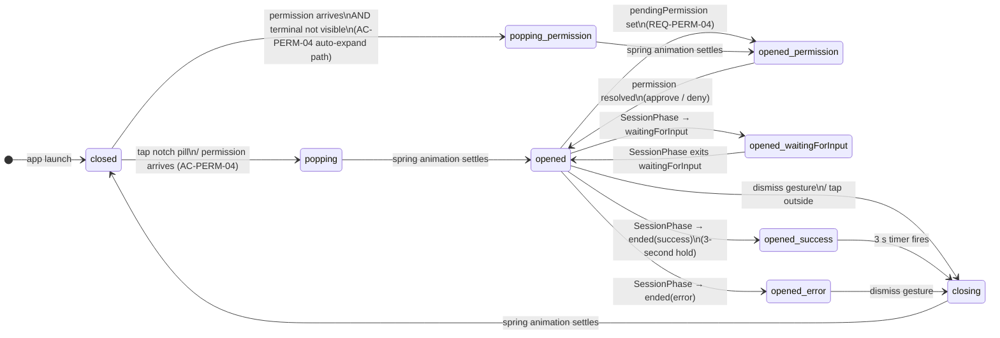
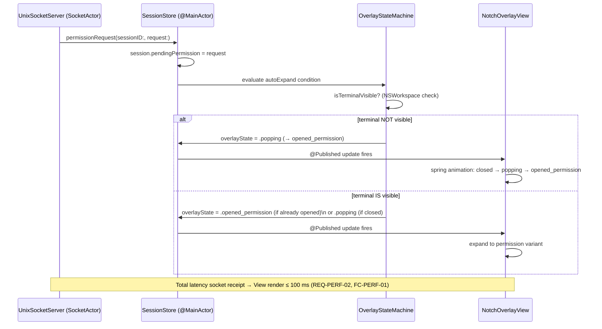
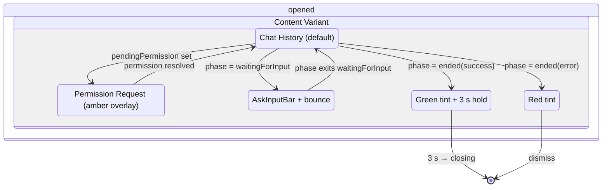
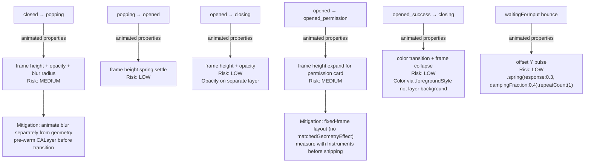

---
codd:
  node_id: detail:notch_overlay_state_machine
  type: design
  depends_on:
  - id: design:ui-design
    relation: depends_on
    semantic: technical
  depended_by:
  - id: plan:implementation-plan
    relation: depends_on
    semantic: technical
  conventions:
  - targets:
    - detail:notch_overlay_state_machine
    reason: All state transitions (closed → popping → opened and reverse) must be
      implemented as spring animations achieving 60 fps (REQ-PERF-01, REQ-UI-03).
      Any transition path that drops below 60 fps is a release-blocking defect.
  - targets:
    - detail:notch_overlay_state_machine
    reason: Overlay must expand automatically when a tool permission request arrives
      and the terminal is not visible (REQ-PERM-04). Missing this auto-expansion path
      blocks release.
---

# Notch Overlay State Machine

## 1. Overview

`NotchOverlayView` is driven by a finite state machine (FSM) whose transitions are owned exclusively by `SessionStore`, an `ObservableObject` confined to the `@MainActor`. Every state transition is expressed as a SwiftUI spring animation targeting ≥ 60 fps (REQ-PERF-01, REQ-UI-03). Any transition path that drops a rendered frame below the 16.67 ms budget is classified as FC-PERF-02 — a release-blocking defect.

The FSM has two orthogonal axes:

1. **Visibility axis** — controls whether the overlay pill is collapsed (`closed`) or expanded (`opened`), with transient `popping` and `closing` states during animation.
2. **Content axis** — controls which content variant fills the expanded area: default chat history, permission request amber overlay, `waitingForInput` input bar, or success/error end-state tinting.

These axes compose: a permission request that arrives while the overlay is `closed` forces a `closed → popping → opened(permissionExpanded)` path. The FSM must handle every combination of visibility and content state without branching into undefined behavior.

The complete canonical state type is `OverlayState`, defined as an enum in `NotchOverlayStateMachine.swift` (owned by `module:overlay`). No other module may redefine or shadow this type. `SessionStore` holds a single `@Published var overlayState: OverlayState` property; all views read from it and must not mutate it directly.

---

## 2. Mermaid Diagrams

### 2.1 Primary Visibility State Machine



**Ownership and implementation boundary:** `OverlayState` is the single source of truth. `SessionStore` is the sole writer. `NotchOverlayView`, `CompactBar`, `ExpandedContent`, and `PermissionRequestView` are all read-only observers; they react to `overlayState` changes via SwiftUI's `@Published` binding mechanism. No view may call a state-mutating method on `SessionStore` except through the designated action API (`SessionStore.openOverlay()`, `.closeOverlay()`, `.acceptPermission()`, `.denyPermission()`). Circumventing these action methods is a correctness defect and constitutes a violation of the ownership boundary.

### 2.2 Auto-Expansion Path for Permission Requests (REQ-PERM-04 / AC-PERM-04)



**Ownership:** `SocketActor` publishes raw `PermissionRequest` values to `SessionStore` via an `AsyncStream`; it has no knowledge of overlay visibility. The auto-expand decision is made entirely inside `SessionStore.handleIncomingPermission(_:)` on the `@MainActor`. This keeps socket I/O and UI policy strictly decoupled.

The latency budget of 100 ms (±10 ms) (REQ-PERF-02, AC-PERM-01) spans from the instant `SocketActor` receives the complete permission frame to the moment `PermissionRequestView` is drawn on screen. Measurement is enforced in CI by timestamping the `SocketActor` receipt and comparing it to the `@Published` update timestamp on the main actor.

### 2.3 Content-Layer Composition



**Ownership:** `ExpandedContent` is a single SwiftUI view that switches between content variants using `@ViewBuilder` conditional rendering keyed on `overlayState`. It must not contain separate `NavigationStack` or sheet presentations — all content variants are in-place layout swaps within the same `ZStack` to preserve geometry and avoid animation discontinuities.

### 2.4 Frame-Drop Risk and Animation Properties



**CI enforcement:** All six transition paths are exercised by `xcrun xctrace` Time Profiler on a Release build on both Apple Silicon and Intel targets. A frame exceeding 16.67 ms (the 60 fps budget) on any path is classified FC-PERF-02 and blocks release. The CI job runs as a step named `overlay-perf-gate` in the Xcode Cloud workflow.

---

## 3. Ownership Boundaries

### 3.1 Module-to-Type Mapping

| Type / Symbol | Canonical Owner | Permitted Importers |
|---|---|---|
| `OverlayState` enum | `module:overlay` → `NotchOverlayStateMachine.swift` | `SessionStore`, all overlay views |
| `SessionStore` | `module:overlay` | All overlay views; `module:ipc` (read-only via `@Published`) |
| `PermissionRequest` struct | `module:ipc` | `SessionStore`, `PermissionRequestView`, `PermissionRouter` |
| `PermissionRouter` | `module:ipc` | `SessionStore` (calls `respond(sessionID:approved:)`) |
| `SocketActor` | `module:ipc` | `SessionStore` (consumes `AsyncStream`) |
| `ChatParseActor` | `module:chat` | `SessionStore` (receives `[ChatMessage]` on `@MainActor`) |
| `ScreenSelector` | `module:overlay` | `NotchOverlayWindow`, `SettingsView` |
| `SoundPlayer` | `module:overlay` | `SessionStore` (called on `ended(success)` transition) |

No module outside `module:overlay` may read or write `overlayState` directly. `module:ipc` communicates exclusively by pushing `PermissionRequest` values into `SessionStore`'s intake method; it has no reference to `OverlayState`.

### 3.2 State Mutation Ownership

`SessionStore` is the **sole legal mutator** of `overlayState`. The following action methods are the complete public API for state changes:

| Method | Triggered by | Resulting transition |
|---|---|---|
| `openOverlay()` | tap notch pill | `closed → popping` |
| `closeOverlay()` | dismiss gesture | `opened → closing` |
| `handleIncomingPermission(_:)` | `SocketActor` stream | conditional `→ popping_permission` or `→ opened_permission` |
| `acceptPermission(sessionID:)` | `PermissionRequestView` Approve button | `opened_permission → opened` |
| `denyPermission(sessionID:)` | `PermissionRequestView` Deny button | `opened_permission → opened` |
| `handlePhaseChange(_:sessionID:)` | `SessionStore` internal observer | drives content-axis transitions |
| `handleSuccessTimer()` | `Timer.scheduledTimer(withTimeInterval: 3.0)` | `opened_success → closing` |

Views call action methods on `SessionStore`; they must not set `overlayState` directly. This single-writer invariant ensures that transition guards (e.g. "only auto-expand if terminal not visible") are evaluated in one place and are not inadvertently bypassed by a view.

### 3.3 Notch vs. Floating-Pill Frame Ownership

`NotchOverlayWindow` owns the `NSWindow` frame calculation. `ScreenSelector` publishes `selectedScreen: NSScreen`; `NotchOverlayWindow` calls `updateFrame(for:)` whenever `selectedScreen` changes or `NSApplication.didChangeScreenParametersNotification` fires.

Notch detection: `NSScreen.safeAreaInsets.top > 0` on `selectedScreen`. When true, the pill width matches the notch bounding rectangle and extends 4 pt below the notch bottom edge (notch mode, REQ-UI-01). When false, the pill is centered horizontally at the top of the screen with 8 pt top margin (floating-pill fallback, REQ-UI-04, REQ-COMPAT-03). Both modes share `NotchOverlayView`; only the `NSHostingView` frame differs.

The floating-pill fallback path is exercised in CI on a non-notch Simulator target. Absence of the fallback path constitutes FC-UI-01 and blocks release.

---

## 4. Implementation Implications

### 4.1 Spring Animation Requirements (REQ-PERF-01, REQ-UI-03 — Release-Blocking)

All state transitions must use SwiftUI spring animations. The canonical animation modifier is:

```swift
withAnimation(.spring(response: 0.35, dampingFraction: 0.72)) {
    overlayState = newState
}
```

Geometry changes (frame height) and opacity changes are animated in the same `withAnimation` block unless the risk assessment in §2.4 identifies them as separately animatable for frame-drop mitigation. Blur radius animations use a distinct `.animation(.spring, value: overlayState)` modifier on the `PillShapeBackground` layer to decouple them from geometry layout passes.

`matchedGeometryEffect` is explicitly prohibited inside `ExpandedContent` because it triggers an additional layout pass during expansion, violating the 16.67 ms frame budget under the MEDIUM-risk permission-expand path. Fixed-frame layout with `frame(width:height:)` constraints is mandatory for all `PermissionRequestView` sizing.

### 4.2 Auto-Expansion Guard for Permission Requests (AC-PERM-04 — Release-Blocking)

`SessionStore.handleIncomingPermission(_:)` must execute the following guard before assigning `overlayState`:

```swift
@MainActor
func handleIncomingPermission(_ request: PermissionRequest, for sessionID: UUID) {
    guard let session = sessions[sessionID] else { return }
    session.pendingPermission = request
    let terminalVisible = NSWorkspace.shared.frontmostApplication?.bundleIdentifier
        == session.terminalBundleIdentifier
    if overlayState == .closed || (!terminalVisible && overlayState != .opened) {
        withAnimation(.spring(response: 0.35, dampingFraction: 0.72)) {
            overlayState = terminalVisible ? .opened_permission : .poppingPermission
        }
    } else {
        withAnimation(.spring(response: 0.35, dampingFraction: 0.72)) {
            overlayState = .opened_permission
        }
    }
}
```

The condition `!terminalVisible` directly implements AC-PERM-04. Omitting this path is a release-blocking defect because tool permission requests would silently queue without the user seeing them.

### 4.3 Permission Routing Correctness (AC-PERM-03, AC-PERM-05 — FC-PERM-01 Release-Blocking)

When `acceptPermission(sessionID:)` or `denyPermission(sessionID:)` is called, `PermissionRouter.respond(sessionID:approved:)` writes the JSON response `{"type":"permission_response","approved":true|false}` back to the exact `UnixSocketServer` client connection that originated the request. For sessions with a non-nil `tmuxPane`, the response is additionally sent to the identified tmux pane.

If `session.tmuxPane` is nil at approval time for a session that requires tmux routing, `PermissionRequestView` must surface a visible warning and block the Approve/Deny buttons until the routing state is resolved. Silent delivery to socket-only in this case is not permitted (per OQ-UI-003 resolution requirement). The chosen fallback behavior must be covered by an integration test exercising two concurrent sessions in separate tmux panes before the hooks feature ships.

### 4.4 Latency Budget Compliance (REQ-PERF-02 — FC-PERF-01 Release-Blocking)

The complete path from `SocketActor` frame receipt to `PermissionRequestView` render must complete within 100 ms (±10 ms). Implementation requirements:

- `SocketActor` timestamps each incoming frame at the point of full receipt.
- `SessionStore.handleIncomingPermission(_:)` is called via `AsyncStream` consumption on the `@MainActor`; no intermediate actor hop is introduced.
- The `@Published` update fires synchronously within the same main-actor turn as `handleIncomingPermission`.
- SwiftUI's next render cycle must pick up the state change within one display refresh (16.67 ms at 60 fps).

Total budget breakdown: ~10 ms socket I/O → ~5 ms actor dispatch → ~16.67 ms render = ~32 ms realistic path, well within 100 ms. CI verifies the end-to-end timestamp delta using a test harness that injects a synthetic permission frame and asserts the view has rendered within 100 ms using `XCTestExpectation` with a `waitForExpectations(timeout: 0.1)` call.

### 4.5 JSONL Parsing Thread Safety (REQ-PERF-03 — FC-PERF-03 Release-Blocking)

`ChatParseActor` runs all file I/O and JSONL parsing on a background actor. Results are published to the main actor via:

```swift
@MainActor func updateHistory(_ messages: [ChatMessage])
```

An `assert(Thread.isMainThread == false)` fires inside `ChatParseActor`'s parsing methods during debug builds. Violating this assertion (parsing on the main thread) constitutes FC-PERF-03 and blocks release. `SessionStore` uses a timestamp-based cache keyed on `UUID` and JSONL file modification date; switching `activeSessionID` reads from cache synchronously on the main actor without triggering a re-parse.

### 4.6 Screen Disconnect Resilience (REQ-SCREEN-04, REQ-SCREEN-03 — FC-REL-03 Release-Blocking)

`ScreenSelector` must not crash or set `selectedScreen` to nil when the persisted screen is disconnected. The fallback chain:

1. `UserDefaults["selectedDisplayIdentifier"]` → match by `CGDirectDisplayID` in `NSScreen.screens`.
2. If no match → `NSScreen.screens.first`.
3. If `NSScreen.screens` is empty (pathological) → `NSScreen.main`.

A unit test asserts that a mock `NSScreen.screens` array with the selected screen removed produces a non-nil `selectedScreen` and does not throw. This test is a required CI gate (FC-REL-03).

### 4.7 Security Constraints Compliance

**App Sandbox disabled (REQ-SEC-01):** The overlay requires unrestricted `NSScreen` and `NSWindow` level access. CI asserts `com.apple.security.app-sandbox = false` in the entitlements file before code-signing. This is verified in the `verify-entitlements` CI step.

**No focus steal:** `NotchOverlayWindow` sets `canBecomeKey = false` and never calls `NSApp.activate`. The exception under OQ-UI-002 (AskInputBar focus) must be resolved before `AskUserQuestion` ships. Until then, `canBecomeKey` must remain `false` and the `@FocusState` binding behavior on macOS 15.6 must be validated on physical hardware.

**Hook consent gate (AC-HOOK-01 — FC-HOOK-01 Release-Blocking):** `HookInstaller.enable()` is called only from the alert confirmation handler inside `SettingsView`. There is no background, timer-based, or notification-triggered code path that writes to `~/.claude/hooks/`. Any such path introduced during implementation is a release-blocking security defect.

**Telemetry isolation (REQ-SEC-05 — FC-SEC-02 Release-Blocking):** `NotchOverlayView`, `ChatHistoryView`, `PermissionRequestView`, and `AskInputBar` contain no import of `mixpanel-swift` and make no direct calls to `MixpanelBridge`. All analytics flow through `AnalyticsClient`. The two permitted events (`app_launched`, `session_started`) carry no message content, tool names, file paths, or user-identifying data. Compliance is verified before each release by auditing every `AnalyticsClient` call site.

**Notarization (REQ-SEC-03 — FC-SEC-03 Release-Blocking):** `xcrun notarytool submit --wait` and `xcrun stapler validate` must both succeed before the DMG is published.

---

## 5. Open Questions

**OQ-SM-001 — `canBecomeKey` and `@FocusState` Compatibility (inherits OQ-UI-002)**
The interaction between `canBecomeKey = false` and SwiftUI's `@FocusState` binding has not been tested on macOS 15.6. If `canBecomeKey` must be temporarily elevated to `true` while `AskInputBar` is active, the state machine needs a dedicated sub-state (`opened_waitingForInput_focused`) that sets `canBecomeKey = true` on entry and resets it on exit. The focus-steal risk during this sub-state must be re-evaluated and a concrete decision documented before `AskUserQuestion` ships.

**OQ-SM-002 — tmux Routing Nil Guard Behavior (inherits OQ-UI-003 and system design OQ-007)**
When `session.tmuxPane == nil` at approval time for a tmux session, the state machine must transition to a defined blocking sub-state rather than silently proceeding. The exact name and behavior of this sub-state (`opened_permissionBlocked`?) and its dismissal path must be specified in a follow-up design note and covered by an integration test before the hooks feature ships. FC-PERM-01 is release-blocking.

**OQ-SM-003 — Concurrent Permission Requests Across Sessions**
The FSM currently models a single `pendingPermission` per `overlayState`. If two concurrent Claude Code sessions in separate tmux panes both issue permission requests simultaneously, the second request will overwrite `overlayState` while the first permission is still pending. A queueing strategy (FIFO `[PermissionRequest]` with sequential display) or a session-picker UI for multi-session permission handling must be designed. Until resolved, multi-session permission correctness is untested and the behavior is undefined.

**OQ-SM-004 — Telemetry Opt-Out Toggle Impact on Settings Item Count (inherits OQ-UI-004)**
If EU distribution requires an "Allow anonymous analytics" toggle in `SettingsView`, the item count increases from exactly six (AC-SET-02) to seven. Whether AC-SET-02 should be amended to permit seven items, or whether the opt-out should live in a secondary "Advanced" section outside the primary six-item list, must be decided before EU distribution begins. The state machine is not affected, but `SettingsView`'s layout constraint is.

**OQ-SM-005 — Notch Width Validation Across Hardware (inherits OQ-UI-001)**
The notch bounding rectangle derived from `NSScreen.safeAreaInsets.top` has not been validated for sub-point alignment on every shipping notch geometry (14-inch vs. 16-inch MacBook Pro). If the safeAreaInsets values differ between models in ways that cause the pill to misalign with the physical notch, the frame calculation in `NotchOverlayWindow.updateFrame(for:)` requires a hardware-specific correction table. Validation on physical hardware for each supported notch configuration is required before release.
