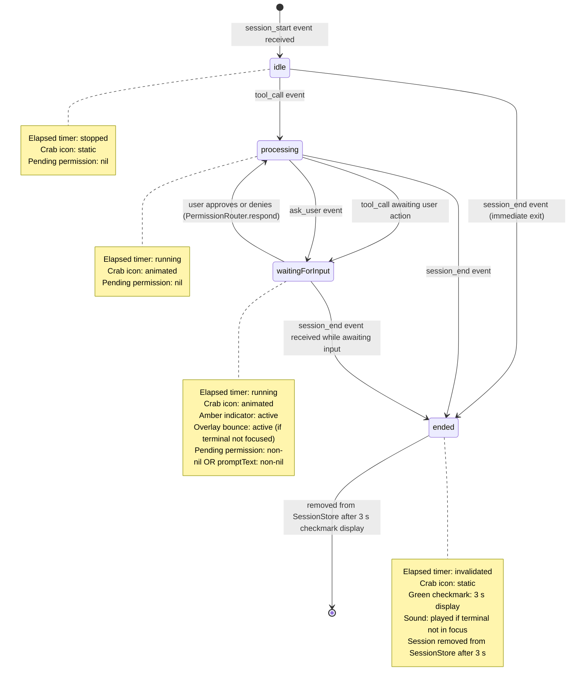
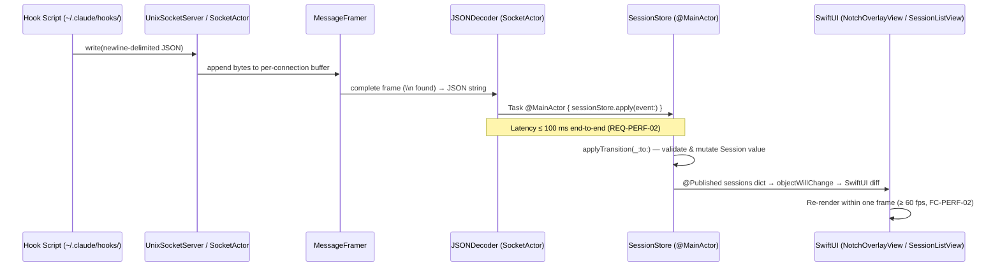
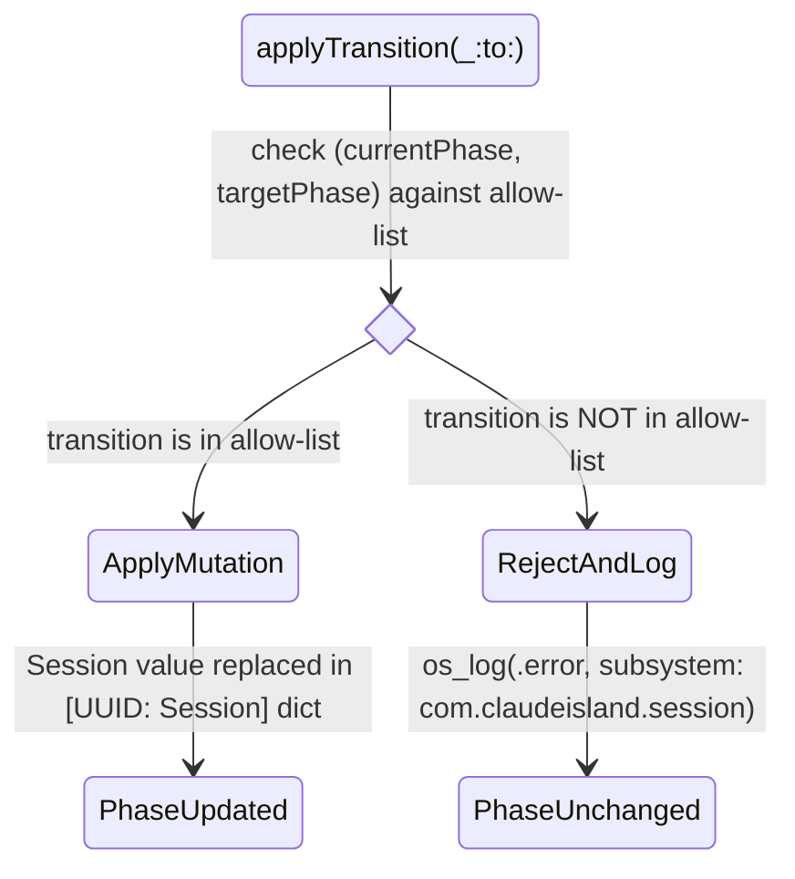

---
codd:
  node_id: detail:session_state_machine
  type: design
  depends_on:
  - id: design:session-lifecycle-design
    relation: depends_on
    semantic: technical
  depended_by:
  - id: test:test-strategy
    relation: depends_on
    semantic: technical
  - id: plan:implementation-plan
    relation: depends_on
    semantic: technical
  conventions:
  - targets:
    - detail:session_state_machine
    reason: Every transition in the SessionPhase state machine must have a corresponding
      unit test (REQ-TEST-02). A diagram with untested transitions is implementation-incomplete
      and blocks release.
  - targets:
    - detail:session_state_machine
    reason: The /clear command must reset session state (REQ-MON-05). The diagram
      must include this transition or the feature is omitted.
---

# Session State Machine Diagram

## 1. Overview

The `SessionPhase` state machine is the authoritative lifecycle model for every Claude Code CLI session tracked by Claude Island. It drives the SwiftUI overlay, the crab animation, the elapsed-time timer, the permission-request UI, and the completion sound. Every component that reacts to session state — `NotchOverlayView`, `PermissionRequestView`, `SessionListView`, `SoundPlayer`, `PermissionRouter` — reads `SessionPhase` and must not implement its own parallel state logic.

`SessionPhase` is defined as a four-case Swift `enum` conforming to `Equatable`:

```swift
enum SessionPhase: Equatable {
    case idle
    case processing
    case waitingForInput
    case ended
}
```

All mutations occur inside `SessionStore.apply(event:)`, which runs exclusively on the `@MainActor`. Transitions are validated by `SessionStore.applyTransition(_:to:)` before any side effects execute. Rejected transitions emit an `os_log` error at subsystem `com.claudeisland.session`, category `state-machine`, and leave the current phase unchanged — no crash, no silent state corruption.

**Release-blocking constraints reflected in this document:**

| Constraint ID | Requirement | Enforcement |
|---|---|---|
| REQ-TEST-02 / FC-TEST-01 | Every valid `SessionPhase` transition has a passing unit test | Eight test methods in `ClaudeIslandTests`; absence of any single test blocks release |
| REQ-MON-05 / AC-MON-05 | `/clear` command removes session within 100 ms of `session_end` event | `testClearCommandSessionRemoval` unit test asserts removal ≤ 100 ms |
| REQ-PERF-02 / FC-PERF-01 | Socket event → `@Published` UI update ≤ 100 ms (±10 ms tolerance) | `testLatencySocketToPublished` integration test in `ClaudeIslandIntegrationTests` |
| AC-MON-01 | ≥ 3 concurrent sessions monitored simultaneously | Integration test with three simultaneous hook clients |
| FC-PERM-01 | Approval responses routed to correct tmux pane via `request_id`-keyed descriptor | `testConcurrentTwoPaneSessions` integration test |
| FC-PERF-02 | Overlay animation ≥ 60 fps | XCTest `testOverlayAnimationFrameRate` performance measurement |

---

## 2. Mermaid Diagrams

### 2.1 SessionPhase State Machine



`SessionStore` is the sole owner of this state machine. No other type may call `applyTransition(_:to:)` or mutate `Session.phase` directly. `PermissionRouter`, `SoundPlayer`, `ChatHistoryParser`, and all SwiftUI views read `SessionPhase` as consumers; they never write it. Any future module that needs to react to phase changes must subscribe via SwiftUI's `@Published` mechanism or via a dedicated observer registered with `SessionStore` — reimplementing phase-tracking logic elsewhere constitutes an ownership violation.

### 2.2 Event-to-Transition Dispatch Flow



`SocketActor` owns the byte-level I/O and per-connection `MessageFramer` buffers. `SessionStore` owns all semantic state. The boundary between them is the `IPCEvent` value type: `SocketActor` produces it, `SessionStore` consumes it. JSON parsing runs synchronously on `SocketActor` before the main-actor dispatch, satisfying REQ-PERF-03 (JSONL parse must not block the main thread, FC-PERF-03).

### 2.3 /clear Command Session Removal Path

```mermaid
sequenceDiagram
    participant Terminal as Terminal (tmux pane)
    participant Claude as Claude Code Process
    participant Hook as session_stop hook script
    participant Socket as SocketActor
    participant Store as SessionStore (@MainActor)
    participant List as SessionListView

    Terminal->>Claude: user types /clear
    Claude->>Hook: executes session_stop hook
    Hook->>Socket: write({ "type": "session_end", "session_id": "<uuid>" })
    Note over Hook,Store: ≤ 100 ms from socket write to @Published update (AC-MON-05)
    Socket->>Store: IPCEvent.session_end dispatched on @MainActor
    Store->>Store: applyTransition(session, to: .ended)
    Store->>Store: invalidate elapsed timer; start 3 s checkmark timer
    Store->>List: @Published update → session shows checkmark
    Store->>Store: after 3 s: sessions[uuid] = nil
    Store->>List: @Published update → session removed from list
```

The `/clear` command causes Claude Code to exit and emit a `session_end` event via the `session_stop` hook. `SessionStore` transitions the session to `.ended` and removes it from `sessions` within 100 ms of the socket write (AC-MON-05). The 3-second checkmark display is a UI affordance; the semantic removal (transition to `.ended`, timer invalidation, `PermissionRouter` connection expiry) happens immediately on `session_end` receipt. `testClearCommandSessionRemoval` asserts that `sessions[uuid]` transitions to `.ended` within 100 ms of the test-injected `session_end` event.

### 2.4 Invalid Transition Guard



The allow-list enforced by `applyTransition(_:to:)` is exactly the six valid transitions: `idle→processing`, `idle→ended`, `processing→waitingForInput`, `processing→ended`, `waitingForInput→processing`, `waitingForInput→ended`. Attempts to transition `ended→processing`, `ended→waitingForInput`, or `waitingForInput→idle` hit the reject path. Rejected transitions never crash the process, consistent with the stability requirement (AC-MON-02). Unit tests `testInvalidTransitionEndedToProcessingRejected` and `testInvalidTransitionEndedToWaitingRejected` assert the phase is left unchanged and that the expected `os_log` error is emitted using `XCTNSLogExpectation`.

---

## 3. Ownership Boundaries

### SessionStore — single owner of SessionPhase

`SessionStore` is the sole writer of `Session.phase`. It is declared `@MainActor final class` conforming to `ObservableObject`. No other type may assign to `session.phase` or call `applyTransition(_:to:)`. Consumers — `NotchOverlayView`, `PermissionRequestView`, `SessionListView`, `SoundPlayer`, `PermissionRouter` — hold a reference to `SessionStore` injected via SwiftUI's environment; they read `sessions` and `sessions[id]?.phase` but never mutate them.

`PermissionRouter` is owned by `SessionStore` as a child object (`let permissionRouter = PermissionRouter()`). It is not an independent singleton. Access to `PermissionRouter` outside `SessionStore` is not permitted; call sites reach it only through `SessionStore` methods such as `sessionStore.respondToPermission(requestId:decision:)`.

### SocketActor — owner of byte I/O and IPCEvent production

`SocketActor` owns the `UnixSocketServer`, the set of accepted `FileDescriptor` values, and the per-connection `MessageFramer` buffers. It produces `IPCEvent` values and dispatches them to `SessionStore` via `Task { @MainActor in ... }`. `SocketActor` does not hold `Session` references and does not read `SessionPhase`. The boundary is the `IPCEvent` value type.

When a `tool_call` or `ask_user` event arrives, `SocketActor` packages the originating `FileDescriptor` alongside the `IPCEvent` and passes both to `SessionStore.apply(event:fd:)`. `SessionStore` forwards the descriptor to `PermissionRouter.register(requestId:fd:)`. After registration, `SocketActor` retains no reference to the descriptor for that request; all subsequent writes to it are dispatched from `PermissionRouter` back through `SocketActor` via an async write method.

### SoundPlayer — stateless consumer

`SoundPlayer` is a stateless struct with a single entry point `play(for phase: SessionPhase, terminalHasFocus: Bool)`. It is called by `SessionStore` inside the `session_end` event handler (§2.4 of the lifecycle design). `SoundPlayer` does not observe `SessionPhase` independently; it never holds a `Session` reference.

### ChatHistoryParser — background actor, cache owned by SessionStore

`ChatHistoryParser` runs on `ChatActor` and produces `[ChatMessage]`. It has no knowledge of `SessionPhase`. `SessionStore` owns the cache `chatHistory: [UUID: [ChatMessage]]` and triggers re-parsing on `tool_result` events. `ChatActor` must never be called from the main thread (FC-PERF-03).

### SwiftUI Views — read-only consumers

`NotchOverlayView`, `SessionListView`, `PermissionRequestView`, and `ChatHistoryView` are read-only consumers of `SessionStore`. They render derived state; they do not track phase themselves. Animated behaviors driven by `SessionPhase`:

- `processing` or `waitingForInput` → crab icon animates via `withAnimation(.spring(response: 0.3, dampingFraction: 0.7))`
- `waitingForInput` → amber indicator, optional bounce animation via `withAnimation(.interpolatingSpring(stiffness: 300, damping: 10))`
- `ended` → green checkmark for 3 seconds, then view removed
- `idle` or `ended` → crab icon static

---

## 4. Implementation Implications

### Transition table as a switch expression

`applyTransition(_:to:)` must be implemented as an exhaustive `switch (currentPhase, targetPhase)` expression. The allow-list is six cases; all other combinations fall to the `default` branch which logs and returns without mutation. Using a `switch` expression (not a chain of `if` statements) ensures the Swift compiler will warn if the `SessionPhase` enum gains a new case without updating the guard.

### Session as a value type — no in-place mutation

`Session` is a `struct`. Every phase transition produces a new `Session` value assigned back to `sessions[uuid]`. This means:

```swift
// CORRECT
var updated = sessions[uuid]!
updated.phase = newPhase
sessions[uuid] = updated   // triggers @Published

// WRONG — mutation via inout would also work but obscures the replace semantics
sessions[uuid]!.phase = newPhase  // legal Swift but avoid for clarity
```

The immutability invariant applies: `SessionStore` replaces dictionary entries; it never mutates values in place through multiple code paths, since doing so makes it harder to reason about which property changed on a given `@Published` emission.

### Elapsed timer ownership

A single `Timer` per session is stored in `SessionStore` alongside the session, not inside the `Session` struct (which is a value type and cannot own a `Timer`). A parallel dictionary `private var timers: [UUID: Timer] = [:]` holds live timers. On transition to `processing` from `idle`, a timer is created and inserted. On transition to `ended` or to `idle` (via a synthetic orphan-reaper path), the timer is invalidated and removed. Transitions from `waitingForInput` back to `processing` leave the existing timer running.

### /clear command compliance (REQ-MON-05 / AC-MON-05)

The `/clear` command in the terminal causes Claude Code to terminate and the `session_stop` hook to write a `session_end` event. `SessionStore` handles `session_end` synchronously within `apply(event:)` on the main actor: it calls `applyTransition(session, to: .ended)`, invalidates the timer, expires any open `PermissionRouter` connection for the session with a deny response, and replaces the session in the dictionary. This entire sequence is O(1) dictionary operations; the elapsed time from socket write to `@Published` emission is bounded by the 100 ms latency budget (REQ-PERF-02). The 3-second checkmark timer fires after the semantic removal is already complete. `testClearCommandSessionRemoval` injects a `session_end` event directly into `SessionStore` and asserts `sessions[uuid]?.phase == .ended` within 100 ms measured by `XCTestExpectation` with a `fulfill` triggered on the `@Published` sink.

### Concurrent session support

`SessionStore.sessions` is a `[UUID: Session]` dictionary with no capacity cap. The acceptance criterion (AC-MON-01) requires ≥ 3 concurrent sessions. Because each session has an independent `Timer` and an independent entry in `PermissionRouter.openConnections`, and because `SocketActor` maintains per-connection buffers, three concurrent sessions impose three independent data paths with no shared mutable state between them beyond the `SessionStore` dictionary itself. The main-actor serialization ensures correct ordering of dictionary writes without a lock.

### Unit test matrix for REQ-TEST-02

Every valid and explicitly guarded invalid transition must have a corresponding test method in `ClaudeIslandTests`. Absence of any of the first five tests constitutes FC-TEST-01 and blocks release. Tests run against the real `SessionStore`; no mock or stub `SessionStore` is used.

| Test method | Transition | Release gate |
|---|---|---|
| `testIdleToProcessingOnToolCall` | `idle → processing` | REQ-TEST-02 / FC-TEST-01 |
| `testProcessingToWaitingOnPermissionRequest` | `processing → waitingForInput` | REQ-TEST-02 / FC-TEST-01 |
| `testWaitingToProcessingOnApproval` | `waitingForInput → processing` | REQ-TEST-02 / FC-TEST-01 |
| `testProcessingToEndedOnSessionEnd` | `processing → ended` | REQ-TEST-02 / FC-TEST-01 |
| `testWaitingToEndedOnSessionEnd` | `waitingForInput → ended` | REQ-TEST-02 / FC-TEST-01 |
| `testIdleToEndedOnImmediateSessionEnd` | `idle → ended` | REQ-TEST-02 / FC-TEST-01 |
| `testInvalidTransitionEndedToProcessingRejected` | `ended → processing` rejected; phase unchanged | AC-MON-02 |
| `testInvalidTransitionEndedToWaitingRejected` | `ended → waitingForInput` rejected; phase unchanged | AC-MON-02 |
| `testClearCommandSessionRemoval` | `/clear` → `session_end` → `.ended` within 100 ms | AC-MON-05 / REQ-MON-05 |

Each test constructs a `SessionStore` with a pre-seeded `Session` at the required starting phase, injects the triggering `IPCEvent` via `sessionStore.apply(event:)` (called directly on the main actor in the test), and asserts the resulting phase using `XCTAssertEqual(store.sessions[uuid]?.phase, expectedPhase)`.

### Latency budget enforcement

The 100 ms socket-to-`@Published` budget (REQ-PERF-02, FC-PERF-01) is allocated as follows and must not be exceeded:

| Stage | Budget | Notes |
|---|---|---|
| `SocketActor` read + `MessageFramer` assembly | ≤ 20 ms | Per-connection buffered read |
| `JSONDecoder` parse on `SocketActor` | ≤ 10 ms | Single-frame decode |
| Main-actor `Task` dispatch | ≤ 30 ms | Bounded by main run loop contention |
| `SessionStore.apply()` + dictionary replace | ≤ 10 ms | O(1) |
| SwiftUI diff + render | ≤ 30 ms | One frame at 60 fps ≈ 16.7 ms |
| **Total** | **≤ 100 ms** | Tolerance ±10 ms |

`testLatencySocketToPublished` in `ClaudeIslandIntegrationTests` writes a `session_start` frame to a real `UnixSocketServer` bound at a temporary `/tmp/` path, awaits the `@Published` update via a `Combine` sink, and asserts the wall-clock interval is ≤ 110 ms.

### Security and privacy compliance

`AnalyticsClient.track(.session_started)` is the only analytics call in the session lifecycle path. It carries no properties — no `session_id`, `working_dir`, `tool_name`, or any session content (REQ-SEC-05). The Mixpanel call-site audit performed at release time (AC-SEC-03, FC-SEC-02) verifies this. `SessionStore` holds all session data exclusively in process memory; nothing is written to disk by the monitoring subsystem. The Unix domain socket at `~/.claude/claude-island.sock` is the only I/O path; no session data traverses any network interface (REQ-INT-02). App Sandbox is disabled to permit access to `~/.claude/`; hardened runtime is enabled (`ENABLE_HARDENED_RUNTIME = YES`). These controls are verified by CI before code signing.

---

## 5. Open Questions

**OQ-SSM-01 — /clear vs. SIGKILL session_end reliability**
The compliance path for AC-MON-05 assumes the `session_stop` hook script executes when `/clear` is issued. If the Claude Code process is terminated with `SIGKILL` before the hook runs, no `session_end` event is emitted. The 30-second orphan reaper in `SessionStore` (§2.5 of the lifecycle design) is the fallback, but it requires a mechanism to map `session_id` to a PID. This is unresolved as of the current hook script specification (OQ-SLC-01 in the lifecycle design). Until resolved, the AC-MON-05 compliance guarantee applies only to the clean `/clear` path, not to `SIGKILL` termination.

**OQ-SSM-02 — Concurrent tool_call events within a single session**
`Session.pendingPermission` is a single `PermissionRequest?`. If Claude Code emits a second `tool_call` for the same session while the first is still `waitingForInput`, the second request cannot be stored without overwriting the first. The lifecycle design (OQ-SLC-02) defers the queue data structure. Until the queue is specified, `testConcurrentPermissionRequestsSameSession` cannot be written and any concurrent-tool-use scenario is unspecified behavior in the state machine.

**OQ-SSM-03 — EPIPE handling in PermissionRouter response write**
If the hook script process in a tmux pane is killed between sending a `tool_call` event and receiving the response, the file descriptor is closed on the client side. `PermissionRouter.respond(requestId:decision:)` will receive `EPIPE` on the `write()` call. The correct subsequent `SessionPhase` transition — whether to `processing` (assuming the session continues) or to `ended` (assuming the pane is gone) — is not yet specified. This must be decided and covered by an integration test before the `PermissionRouter` implementation is considered release-ready (OQ-SLC-03 in the lifecycle design).

**OQ-SSM-04 — waitingForInput → idle transition validity**
The current allow-list does not include `waitingForInput → idle`. If a future feature (e.g., a user-initiated "cancel pending request" action distinct from deny) needs to return a session to `idle` without emitting `session_end`, the allow-list must be extended and a corresponding unit test added. Adding this transition without updating REQ-TEST-02 coverage would constitute a silent FC-TEST-01 violation for the new path.
